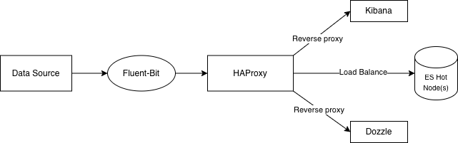

# elastic-stack
Full stack with lots of features written in bash

This is still in testing! I am not a professional coder so expect some typos and not-efficient approaches so don't blame me :)

It is currently tested on Debian/Ubuntu and Centos/Redhat. Alpine Linux support will be added too.

My goal is to simplify Elasticsearch Cluster deployment as possible as simple and flexible. Therefor I have decided to use docker environment with some additional flavors.
The challenges during a standart ES Cluster deployment are
  - System tunings
  - Memory assignments
  - Storage issues
  - Planning
  - Performance
  - Security

To minimize these requirements, I have used the topology as shown below.

