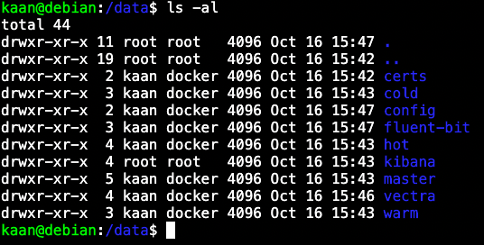
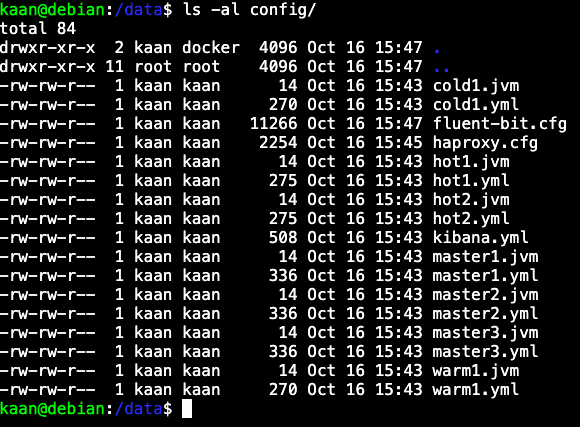
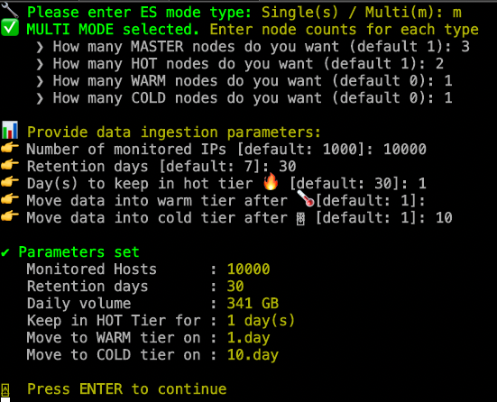
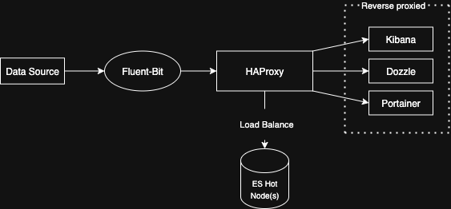
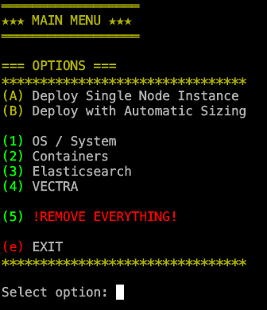
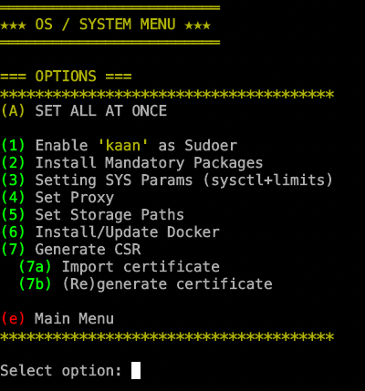
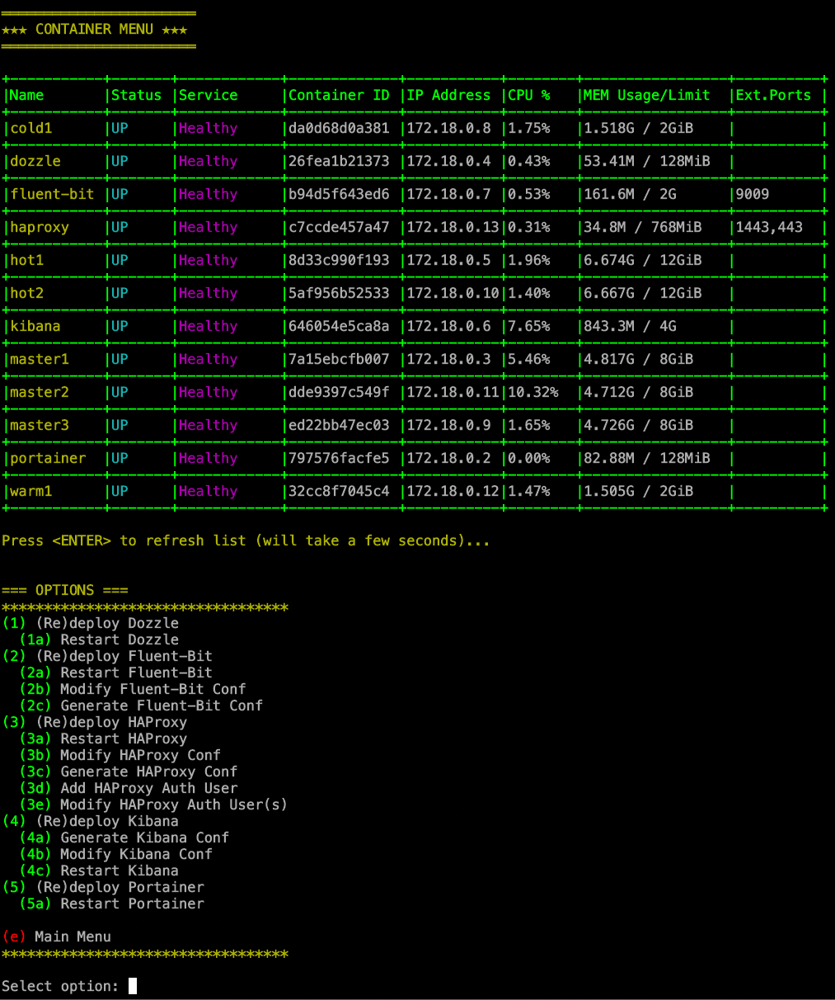
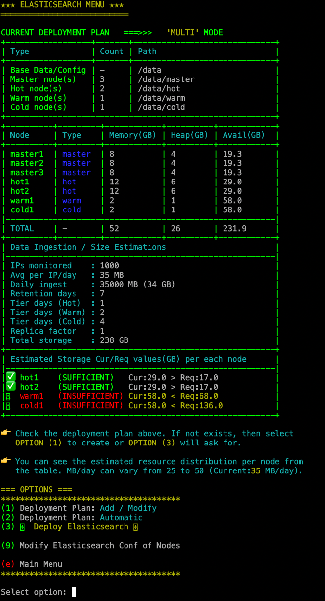
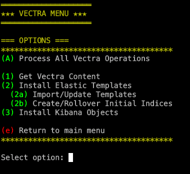

# SIMPLE ELASTICSEARCH STACK INSTALLER
Full stack with lots of features written in bash

Supported platforms

Debian/Ubuntu

Centos/RHEL

## DISCLAIMER
This is still in testing! I am not a professional coder so expect some typos and not-efficient approaches so don't blame me :)

Features to be added
  - Alpine Linux support
  - ÈS security option (optional)
  - Logstash (optional)
  - ES Fleet Server + Agent (optional)
  - Beats (optional)

It is currently tested on Debian/Ubuntu and Centos/Redhat. 
Alpine Linux support will be added too.

## MAIN PURPOSE
The main goal is to create a backend data-lake for various purposes for people who struggle and do not want involve themselves with complex choices and tunings. 
There is also an optional content to be enabled for Vectra Stream Platform. I also tried to add an automatic sizing calculation for Vectra Stream output so during the planning, the system will automatically calculate the required storage space and warn you if something is wrong.

I tried to make Elasticsearch Cluster deployment flexible and simple therefor I have decided to use docker environment with some additional flavors.
The challenges during a standart ES Cluster deployment are
  - System tunings
  - Memory assignments
  - Storage issues
  - Planning
  - Performance
  - Security

## COMPONENTS
Several components have been used in this stack.
  - Fluent-Bit (as ETL)
  - HAProxy (load balancing and reverse proxy)
  - Dozzle (container monitoring)
  - Portainer (container management)
  - Kibana
  - Elasticsearch Nodes

## DETAIL
Because this is a closed environment, I did not enable security in ES side so everything is working on http but HAProxy is used for reverse proxying and I have implemented a http basic authentication with a self-signed certificate. It is possible to create CSR and sign it with your local CA and then import back into stack host or you can directly put your PEM certificate into it. 
You can also add your own authentication mechanism into haproxy.cfg like mTLS, Oath2, etc. since every conf file of each component will be placed into the same folder for easier management. You can even directly edit the file within this script. Keep in mind that every component's config file can be modified through menus during runtime.

When you call one of these URLs below, it will ask for user/password.
Default credential:
username: admin
password: Elastic123!

### URLs to be created
HAProxy Stats (realtime metrics) 
https://<HOST IP/FQDN>/stats

Dozzle (container monitoring) 
https://<HOST IP/FQDN>/dozzle

Portainer 
https://<HOST IP/FQDN>:1443

Kibana 
https://<HOST IP/FQDN>

RAW TCP Listener (can be changed) 
<HOST IP/FQDN>:9009

### folder/mount structure
These directories below are selected for testing. The script will offer you to choose each storage destination individually so you can easily separate different data tiers into different mounts of OS by using local, SMB, NFS, etc.

You can easily access every config file from a single directory so if you want to change or add something, you just need to restart it container. By default after a config file modification, the script will ask for if you want to restart the related container.
### config files

I preferred Fluent-Bit rather than Logstash as it is really lightweight, very high performance with a very small memory footprint. For my needs, Fluent-Bit is more than enough but feel free to implement your own Logstash instance.

As you can see from the topology below, HAProxy will also provide load balancing across ES hot nodes. I did not prefer ingest nodes because I do not need pipeline operations. The HAProxy conf file will be automatically generated according to the number of hot nodes.

Keep in mind that, every config file will be dynamically generated according to you choices prior to deployment. These choices can be done through menus.

### es planning

## STACK TOPOLOGY

When you run the script, everything is quite straightforward and you can navigate yourself through menus. You may want to read the warnings in some menus and act accordingly. Unless you choose deployment option in Elasticsearch menu, you can change your deployment plan and the script will deploy automatically.

## SCREENSHOTS

### Main Menu

### OS/System Menu

### Containers Menu

### Elasticsearch Menu

### Vectra Stream Related

## ENDNOTE
As I mentioned, this is a simple script (but more than 3K lines), its main purpose is to make life easier. 
I believe with no or just a few minor changes, you can even use it for your production environments too.
Since Docker is a very solid environment and if you have a sufficient host with some cpu, mem and disk io/speed, it will handle lots of data and EPS rates.

# I strongly suggest you to use this script in a host which has at least 8 CPU cores with 32 GB of memory. By default the script will reserve 12 GB of memory for additional components and OS. The rest will be distributed between Elasticsearch node(s).

## Since the resource distribution is done automatically, you will end up with a very small java heap memory size in hot node(s) which will dramatically affect the overall performance.
## The script will also show you the final resource summary and overall picture before the deployment as shown above in Elasticsearch menu.
## You can find the default values and resource weight distribution in script between the lines of 130 and 150.
