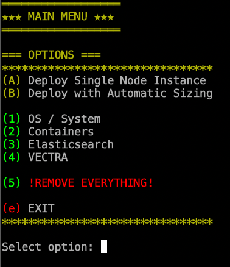

# elastic-stack
Full stack with lots of features written in bash

This is still in testing! I am not a professional coder so expect some typos and not-efficient approaches so don't blame me :)

It is currently tested on Debian/Ubuntu and Centos/Redhat. Alpine Linux support will be added too.

The main goal is to create a backend datalake for Vectra Stream Platform during test/dev phases, but since this is an optional feature, you can use it for any other purposes which needs a serious ES cluster as a backend.
I have tried to make Elasticsearch Cluster deployment as possible as simple and flexible. Therefor I have decided to use docker environment with some additional flavors.
The challenges during a standart ES Cluster deployment are
  - System tunings
  - Memory assignments
  - Storage issues
  - Planning
  - Performance
  - Security

Several components have been used in this stack.
  - Fluent-Bit (instead of Logstash)
  - HAProxy (load balancing and reverse proxy)
  - Dozzle (container monitoring)
  - Portainer (container management)
  - Kibana
  - Elasticsearch Nodes

Stack Topology

When you run the script, everything is quite straightforward and you can navigate yourself through menus.

