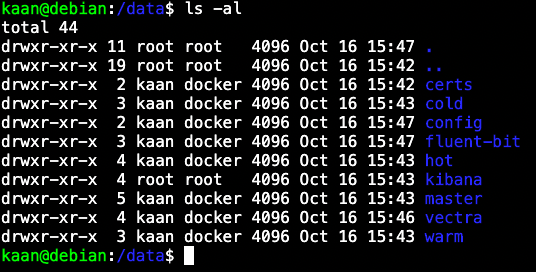
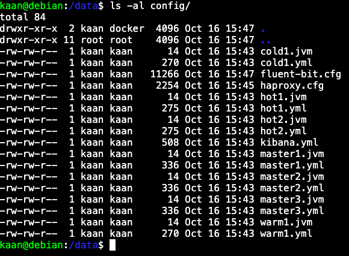
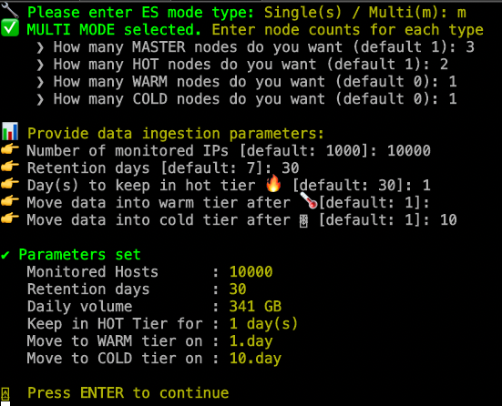
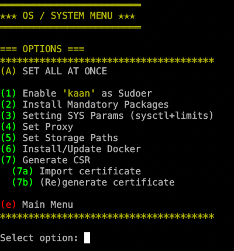
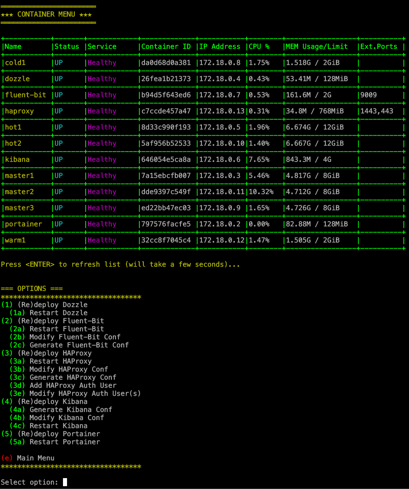
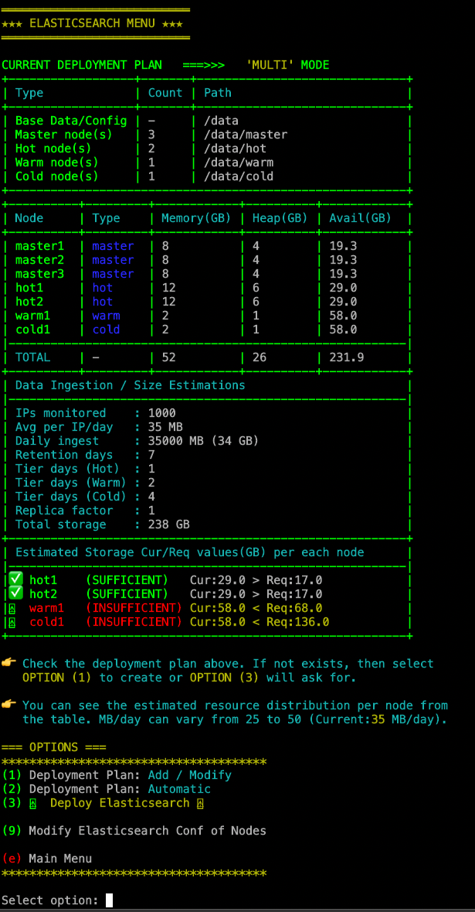
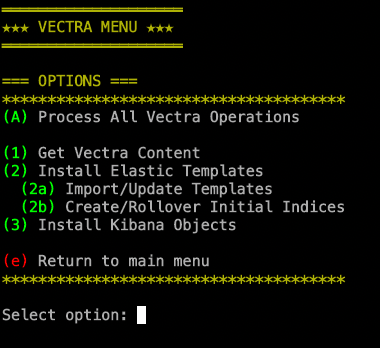

# SIMPLE ELASTICSEARCH STACK INSTALLER
Full stack with lots of features written in bash

## DISCLAIMER
This is still in testing! I am not a professional coder so expect some typos and not-efficient approaches so don't blame me :)

It is currently tested on Debian/Ubuntu and Centos/Redhat. Alpine Linux support will be added too.

## MAIN PURPOSE
The main goal is to create a backend datalake for Vectra Stream Platform during test/dev phases, but since this is an optional feature, you can use it for any other purposes which needs a serious ES cluster as a backend.
I have tried to make Elasticsearch Cluster deployment flexible and simple. Therefor I have decided to use docker environment with some additional flavors.
The challenges during a standart ES Cluster deployment are
  - System tunings
  - Memory assignments
  - Storage issues
  - Planning
  - Performance
  - Security

## COMPONENTS
Several components have been used in this stack.
  - Fluent-Bit (instead of Logstash)
  - HAProxy (load balancing and reverse proxy)
  - Dozzle (container monitoring)
  - Portainer (container management)
  - Kibana
  - Elasticsearch Nodes

## DETAIL
Because this is a closed environment, I did not enable security in ES side so everything is working on http but HAProxy is used for reverse proxying, I have implemented a basic authentication with a self-signed certificate. It is possible to create CSR and sign it with your local CA and then import back into stack host or you can directly put your PEM certificate into it. It is also possible to add you own authentication mechanism into haproxy.cfg since every conf file will be placed into same folder for easier management.

### folder/mount structure
These directories are for testing. The script will offer you to choose each storage destination individually so you can easily separate different data tiers into different mounts of OS.

### config files

I preferred Fluent-Bit rather than Logstash as it is really lightweight with a very small memory requirement. For my needs, Fluent-Bit is more than enough but feel free to implement your own Logstash instance.

As you can see from the topology below, HAProxy will also provide load balancing across ES hot nodes. I did not prefer ingest nodes because I do not need pipeline operations. The HAProxy conf file will be automatically generated according to the number of hot nodes (you )

### es planning

## STACK TOPOLOGY

When you run the script, everything is quite straightforward and you can navigate yourself through menus.

## SCREENSHOTS

### Main Menu

### OS/System Menu

### Containers Menu

### Elasticsearch Menu

### Vectra Related
